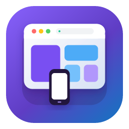
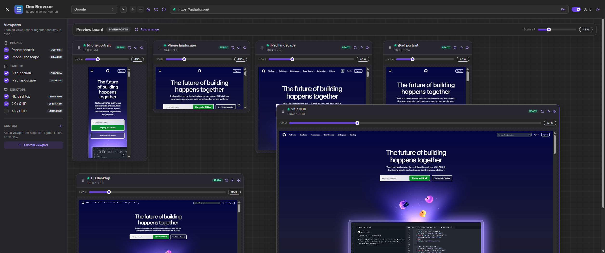

  

# Dev Browzer

**See your website at every important size, all at once.**

  

Dev Browzer is a Windows desktop app for checking a site across phone, tablet, and desktop
screens without constantly resizing a browser window. Open your local site once, then explore it side by side in synchronized previews.

## What you can do

|                                |                                                                                                                    |
| ------------------------------ | ------------------------------------------------------------------------------------------------------------------ |
| **Compare responsive layouts** | Start with the Essential phone, tablet, and HD desktop set, or switch to Mobile, Desktop, All, or a custom preset. |
| **Browse in sync**             | Follow links, redirects, history, hash changes, and popups across every synchronized preview.                      |
| **Repeat review flows**        | Save project routes, step through them in review mode, and restore named viewport and layout presets.              |
| **Inspect realistic devices**  | Configure pixel ratio, user agent, touch, color scheme, reduced motion, and network behavior per viewport.         |
| **Capture visual evidence**    | Capture ready previews together, compare local sessions, add notes, and export a self-contained HTML report.       |

## Start previewing

1. Start the application and create a project. Give it a name, enter your site address (for example, `localhost:3000`), and choose a starting viewport preset.
2. Browse your site. With **Sync** on, the selected previews stay on the same page.

Dev Browzer remembers projects, routes, addresses, enabled viewports, device profiles, and preview
layouts, so the next review begins where the last one ended.

Use `Ctrl+L` to focus the address bar, `Alt+Left` and `Alt+Right` for history, `Ctrl+R` to reload all
previews, `Ctrl+K` for commands, and `Escape` to leave a focused preview.

## Built-in screen sizes

| Device          | Size        |
| --------------- | ----------- |
| Phone portrait  | 390 × 844   |
| Phone landscape | 844 × 390   |
| iPad portrait   | 768 × 1024  |
| iPad landscape  | 1024 × 768  |
| HD desktop      | 1920 × 1080 |
| 2K / QHD        | 2560 × 1440 |
| 4K / UHD        | 3840 × 2160 |

Need a particular laptop, kiosk, or test device? Add a custom viewport and rotate it whenever you
need to compare both orientations.

## A private, local workspace

Dev Browzer works directly with the addresses you give it. It does not require an account, proxy,
backend service, or bundled web server. Project data, captures, annotations, and exported reports
remain on your computer.

## Running Dev Browzer from source

For installation requirements, development commands, quality checks, packaging, and the security model, see the [technical guide](TECHNICAL.md). Notices this appliation is mainly develop by the assist of LLM / AI.

## License

[MIT](LICENSE)
